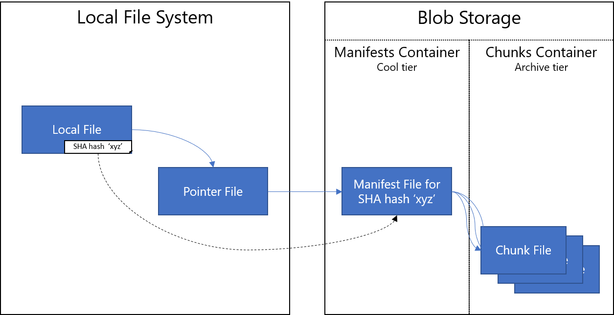
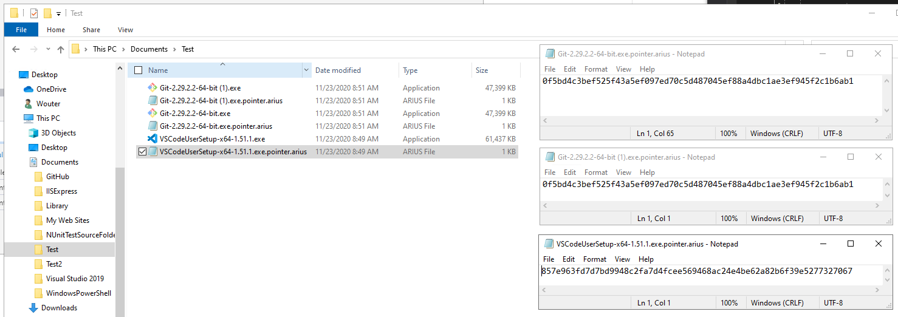
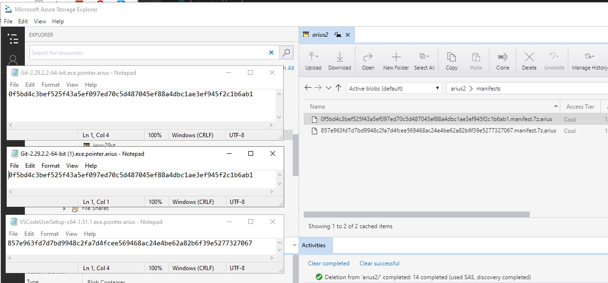
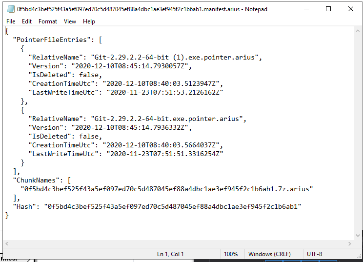

# Arius


[](https://github.com/woutervanranst/Arius/actions/workflows/cli-release-docker.yml)

[](https://github.com/woutervanranst/Arius/actions/workflows/core-release-nuget.yml)

Arius is a lightweight tiered archival solution, specifically built to leverage the Azure Blob Archive tier.

The name derives from the Greek for 'immortal'.

- [Arius](#arius)
  - [Key design scenarios](#key-design-scenarios)
  - [Key design objectives](#key-design-objectives)
  - [Overview](#overview)
    - [Archive](#archive)
    - [Restore](#restore)
  - [Usage](#usage)
    - [Archive to blob storage](#archive-to-blob-storage)
      - [CLI](#cli)
      - [Docker Run](#docker-run)
      - [Arguments](#arguments)
    - [Restore from blob storage](#restore-from-blob-storage)
      - [CLI](#cli-1)
      - [Arguments](#arguments-1)
  - [Installing](#installing)
    - [CLI](#cli-2)
      - [CLI for Linux](#cli-for-linux)
      - [CLI as Docker Container](#cli-as-docker-container)
    - [Windows UI](#windows-ui)
    - [Arius.Core Nuget Package](#ariuscore-nuget-package)
  - [Advanced](#advanced)
    - [Archive](#archive-1)
    - [Restore](#restore-1)
    - [Restore with common tools](#restore-with-common-tools)
    - [Deduplication](#deduplication)
      - [Debugging Docker in Visual Studio](#debugging-docker-in-visual-studio)
- [Attributions](#attributions)

## Key design scenarios

Why did I create Arius?

**Scenario 1**

- I have a lot of static files that I rarely access but don't want to lose (think: backups, family pictures & videos, ...).
- For some of these, I keep a live copy on my Synology
- For all of these, I keep an offline copy on a disconnected harddisk
- To account for the mechanical failure of the harddisk (and to implement the [3-2-1 backup strategy](https://en.wikipedia.org/wiki/Backup#Storage)) I back up the entire hard disk to Azure using Arius. The price for this is approx. 1 EUR per TB per month when using the archive tier.

**Scenario 2**

- (same as Scenario 1) and I also want to have one 'single pane of glass' for all files, eg. if I search for the file in Windows Explorer, I want to see that the file is 'there' (maybe not the contents, but the pointer to the Arius archive).

**Scenario 3**

- I want client side encryption (because of \<reasons>).

**Scenario 4**

- Before my Synology, I had a Windows Server that had deduplication on its file system. My OCD has a hard time storing duplicates ever since.

## Key design objectives

- [x] Maintain the local file structure (files/folders) by creating 'sparse' placeholders (Scenario 2).
- [x] Files, folders & filenames are encrypted clientside (Scenario 3).
- [x] The local filestructure is _not_ reflected in the archive structure (ie it is obfuscated) (Scenario 3).
- [x] Changes in the local file _structure_ do not cause a reshuffle in the archive (which doesn't sit well with Archive storage).
- [x] Never delete files on remote.
- [x] No central store to avoid a single point of failure.
- [x] File level deduplication (Scenario 4).
- [x] Variable block size (rolling hash Rabin-Karp) deduplication (Scenario 4).
- [x] Leverage common tools, to allow restores even when this project would become deprecated.
- [ ] Point in time restore (FUTURE).

## Overview

Arius is a tool that archives a local folder structure to/from Azure Blob Storage Archive Tier. The following diagram shows the concept of how Arius works.



### Archive

1. Arius runs through the files of the (local) folder and subfolders.

1. For each file, it calculates the hash and checks whether (a **manifest** for) this hash already exists on blob storage.

   - If it does not exist, the local file is **chunk**ed (deduplicated). Each chunk is encrypted and uploaded to Archive storage. A **manifest** is then created, the list of chunks that make up the original file.

1. On the local file system, a **pointer file** is then created, pointing to the manifest.

1. For each pointer file, an entry is made in the Pointers table storage (containing relative name and manifest hash). This enables restoring the archive into an empty directory (by first reconstructing all the pointer files and then downloading and reconstituting all the chunks).

The result on the local file system looks like this:


For a more detailed explanation, see [Developer Reference](#developer-reference).

### Restore

A restore consists out of two stages.

1. The first stage (optionally) synchonizes the pointer files in the local file system with the desired state, eg. restore into an empty folder, restore a previous version (point-in-time restore).

1. The second stage (also optionally) downloads the chunks and reassembles the original files.

By deleting the pointers that do not need to be restored before running the second stage, a selective restore can be done.

For a more detailed explanation, see [Developer Reference](#developer-reference).

## Usage

### Archive to blob storage

#### CLI

```
arius archive
   --accountname <accountname>
  [--accountkey <accountkey>]
   --passphrase <passphrase>
  [--container <containername>]
  [--remove-local]
  [--tier=<hot/cool/archive>]
  [--dedup]
  [--fasthash]
  <path>
```

#### Docker Run

```
docker run
  -v <path>:/archive
 [-v <logpath>:/log]
 [-e ARIUS_ACCOUNT_KEY=<accountkey>]
  ghcr.io/woutervanranst/arius:latest

  archive
   --accountname <accountname>
   --passphrase <passphrase>
  [--container <containername>]
  [--remove-local]
  [--tier=<hot/cool/archive>]
  [--dedup]
  [--fasthash]
```

#### Arguments

| Argument | Description | Notes |
| - | - | - |
| &#x2011;&#x2011;accountname, &#x2011;n | Storage Account Name
| &#x2011;&#x2011;accountkey, &#x2011;k | [Storage Account Key](https://docs.microsoft.com/en-us/azure/storage/common/storage-account-keys-manage?tabs=azure-portal) | Can be set through:<ul><li>Argument<li>Environment variable `ARIUS_ACCOUNT_KEY`<li>Docker environment variable `ARIUS_ACCOUNT_KEY`</ul>
| &#x2011;&#x2011;passphrase, &#x2011;p | Passphrase with which the blobs are encrypted (clientside)
| &#x2011;&#x2011;container, &#x2011;c | Blob container to use | OPTIONAL. Default: 'arius'.
| &#x2011;&#x2011;remove-local | Remove local file after a successful upload | OPTIONAL. Default: Local files are deleted after archiving.
| &#x2011;&#x2011;tier | Blob storage tier (hot/cool/archive) | OPTIONAL. Default: 'archive'.
| &#x2011;&#x2011;dedup | Deduplicate within the file (see [here](#deduplication)) | OPTIONAL. Default: false.<br>NOTE: setting this option takes results in a longer run time for but a smaller archive size
| &#x2011;&#x2011;fasthash | When a pointer file is present, use that hash instead of re-hashing the full file again | OPTIONAL. Default: false.<br>NOTE: Do **NOT** use this if the contents of the files are modified. Arius will not pick up the changes.
| path | Path to the folder to archive | <ul><li>CLI: argument `<path>`<li>Docker: as `-v <path>:/archive` volume argument</ul>
| logpath | Path to the folder to store the logs | NOTE: Only for Docker.

### Restore from blob storage

#### CLI

```
arius restore
   --accountname <accountname>
   --accountkey <accountkey>
   --passphrase <passphrase>
  [--container <containername>]
  [--synchronize]
  [--download]
  [--keep-pointers]
  <path>
```

#### Arguments

| Argument | Description | Notes |
| - | - | - |
| &#x2011;&#x2011;accountname, &#x2011;n | (same as above)
| &#x2011;&#x2011;accountkey, &#x2011;k | (same as above)
| &#x2011;&#x2011;passphrase, &#x2011;p | (same as above)
| &#x2011;&#x2011;container, &#x2011;c | (same as above)
| &#x2011;&#x2011;synchronize | Bring the structure of the local file system (pointer files) in line with the latest state of the remote repository | <ul><li>This command only touches the pointers (ie. `.pointer;arius` files). Other files are left untouched.<li>Pointers that exist in the archive but not remote are created.<li>Pointers that exist locally but not in the archive are deleted</ul>
| &#x2011;&#x2011;download | Download and restore the actual file (contents)
| &#x2011;&#x2011;keep-pointers | Keep pointer files after downloading content files
| path | Path to restore to | <ul><li>If  `<path>` is a directory: restore all pointer files in the (sub)directories.<li>If `<path>` is a file: restore this file.</ul>

## Installing

### CLI

#### CLI for Linux

Prerequisites:

- 7zip:

```
sudo apt-get install p7zip-full
```

- azcopy

```
wget https://aka.ms/downloadazcopy-v10-linux
tar -xvf downloadazcopy-v10-linux
sudo cp ./azcopy_linux_amd64_*/azcopy /usr/bin/
```

<!-- Install the latest linux Dapr CLI to `/usr/local/bin`

```bash
wget -q https://raw.githubusercontent.com/dapr/cli/master/install/install.sh -O - | /bin/bash -->

Arius:
<!-- from https://blog.markvincze.com/download-artifacts-from-a-latest-github-release-in-sh-and-powershell/ -->

```
LATEST_RELEASE=$(curl -L -s -H 'Accept: application/json' https://github.com/woutervanranst/arius/releases/latest)
LATEST_VERSION=$(echo $LATEST_RELEASE | sed -e 's/.*"tag_name":"\([^"]*\)".*/\1/')
ARTIFACT_URL="https://github.com/woutervanranst/arius/releases/download/$LATEST_VERSION/release.zip"
wget $ARTIFACT_URL
unzip release.zip
dotnet arius.dll ...
```

#### CLI for Windows

Prerequisites:

- AzCopy: https://docs.microsoft.com/en-us/azure/storage/common/storage-use-azcopy-v10#download-azcopy
- 7zip: https://www.7-zip.org/download.html

TODO

<!-- Install the latest windows Dapr CLI to `c:\dapr` and add this directory to User PATH environment variable. Use `-DaprRoot [path]` to change the default installation directory

```powershell
powershell -Command "iwr -useb https://raw.githubusercontent.com/dapr/cli/master/install/install.ps1 | iex"
https://chocolatey.org/install.ps1

```
-->

#### CLI as Docker Container

```
docker pull ghcr.io/woutervanranst/arius
```

### Windows UI

TODO

### Arius.Core Nuget Package

See https://docs.github.com/en/packages/working-with-a-github-packages-registry/working-with-the-nuget-registry#authenticating-to-github-packages

```
dotnet nuget add source -u <GITHUB_USERNAME> -p <GITHUB_PAT> -n AriusGithub "https://nuget.pkg.github.com/woutervanranst/index.json"
```

## Advanced

### Archive


Consider the following example directory: three files of which two are a duplicate.
Running `arius archive` on a local folder will yield the following:


Arius creates pointer files (ending in .arius.pointer) that reflect the original file/folder structure, have the same name and dates as the original file, yet only 1KB in size.

The original files can now be deleted. _NOTE: Not specifying `--keep-local` will delete the original files by default after a successful archive._

The contents of the pointer files are as follows:



Note that the duplicate files (ie. 'Git-2.29.2.2-64-bit.exe' and 'Git-2.29.2.2-64-bit (1).exe') have the same hash and that the pointers thus point to the same manifest.

The contents of the manifest container are:



Note that there are only two manifests.

The contents of the first manifest (after decryption) are:



The structure of the manifest is as follows:
- PointerFileEntries: the list of pointers pointing to this manifest. From this list the `restore` operation can reconstitute the original file/folder structure.
  - RelativeName: path relative to the root of the folder that was archived
  - Version: date & time at which the local file system contained this entry. Multiple entries can exist for one RelativeName, eg when LastWriteTime is modified or the file is deleted. The `restore` operation takes the last version when restoring. Optionally, for point-in-time restores, this field is used to determine the files to restore.
  - IsDeleted: flag marking the file existed once but is now deleted.
  - CreationTimeUtc, LastWriteTimeUtc: respective properties from the original file. Used when deciding to make a new version of the entry.
- ChunkNames: list of the chunks that make up the original file.
- Hash: the SHA256 hash of the original file.

NOTE: since this file consists of only one chunk, the hash of the chunk and the hash of the original file are the same.

### Restore


### Restore with common tools

Arius relies on the 7zip command line and Azure blob storage cli.

### Deduplication

A 1 GB file chunked into chunks of 64 KB, with each chunk having a SHA256 hash (32 bytes = 64 hex characters) * 4 bytes/UTF8 character = 4 MB of manifest

((1 GB) / (64 KB)) * (64 * 4 bytes) = 4 megabytes

#### Deduplication benchmark for large binary files 

| Min. Chunk Size (B) | Original (KB) | Total Chunks | Deduped KB |  Incremental Length | Time  | MBps  | Avg Chunk Size (KB) |
|-|-|-|-|-|-|-|-|
| N/A  | 2.410.419.052  |      12  |      0  | 2.333.672 (99,14%) |  0:45 | 51,08 |   N/A |
| 1024 | 2.410.419.052  | 262.666  | 125,19  | 2.346.100 (99,67%) | 36:00 | 1,06  |  8,93 |
| 4096 | 2.410.419.052  | 174.589  | 112,33  | 2.341.994 (99,49%) | 24:00 | 1,60  | 13,41 |
| 8192 | 2.410.419.052  | 165.619  | 111,63  | 2.341.567 (99,48%) | 23:00 | 1,67  | 14,14 |

Context: 
- 12 mp4 files of on average 192 MB, totalling 2,24 GB.
- Benchmark performed on an Azure D8s_v3 VM in the same region as the storage account

Conclusions:
- While the chunking algorithm finds duplicate chunks in mp4 files, it is not more effective in achieving a better end result than plain gzip compression (99,48% vs 99,14%)
- A minimum chunk size of 4096 KB achieves the best characteristics while keeping the flexibility of chunking:
  - A significant reduction in number of chunks and runtime (-33%) 
  - A significant increase in speed (+50%)
  - A comparable number of usable deduped chunks (only 11% less)
- A minimum chunk size of 8192 KB achieves further improvements across these dimensions but only marginally so, while (probably?) significantly reducing the potential on bigger datasets

### Debugging Docker in Visual Studio

| Argument | Visual Studio Debug |
| - | - |
| ``--accountname`` | argument in ``commandLineArgs`` in ``launchSettings.json`` |
| ``--accountkey`` | <ul><li>argument in ``commandLineArgs`` in ``launchSettings.json`` (but it would be in source control)</li><li>Environment Variable (``%ARIUS_ACCOUNT_KEY%``) &rarr; <br> Pre-build event in Arius.csproj &rarr; <br> ``<DockerfileRunEnvironmentFiles>``</li>
| ``--passphrase`` | argument  in ``commandLineArgs`` in ``launchSettings.json`` |
| ``(--container)`` | argument  in ``commandLineArgs`` in ``launchSettings.json`` |
| ``(--keep-local)`` | argument in ``commandLineArgs`` in ``launchSettings.json`` |
| ``(--tier)`` | argument in ``commandLineArgs`` in ``launchSettings.json`` |
| ``(--min-size)`` | argument in ``commandLineArgs`` in ``launchSettings.json`` |
| ``(--simulate)``  | argument in ``commandLineArgs`` in ``launchSettings.json`` |
| ``<path>``  | ``<DockerfileRunArguments>`` in ``Arius.csproj``, eg.<br> ``-v "c:\Users\Wouter\Documents\Test:/archive"`


# Attributions

Arius Icon by [Freepik](https://www.flaticon.com/free-icon/iceberg_2055379?related_id=2055379).