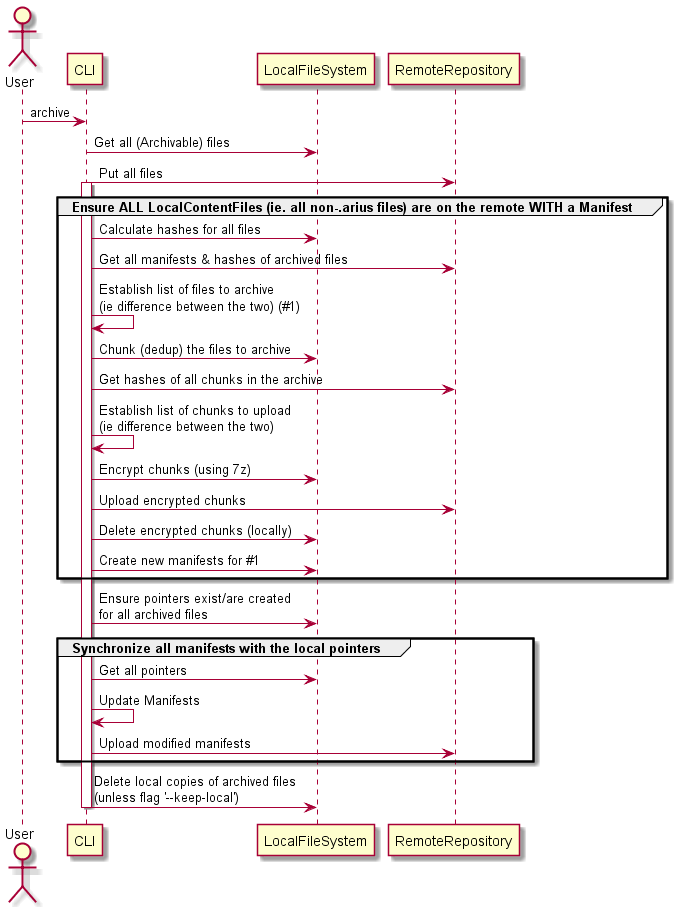

# Arius


Arius is a lightweight tiered archival solution, specifically built to leverage the Azure Blob Archive tier.

The name derives from the Greek for 'immortal'.

- [Arius](#arius)
  - [Key design objectives](#key-design-objectives)
  - [What does it do & how does it work?](#what-does-it-do--how-does-it-work)
    - [Overview](#overview)
    - [Detail](#detail)
  - [Usage](#usage)
    - [Archive to blob storage](#archive-to-blob-storage)
      - [CLI](#cli)
      - [Docker Run](#docker-run)
      - [Arguments](#arguments)
    - [Restore from blob storage](#restore-from-blob-storage)
  - [Install](#install)
    - [Linux](#linux)
    - [Docker](#docker)
  - [Advanced](#advanced)
    - [Restore with common tools](#restore-with-common-tools)
  - [Developer reference](#developer-reference)
    - [Terminilogy](#terminilogy)
    - [Functional Flows](#functional-flows)
      - [Archive](#archive)
    - [Docker](#docker-1)
      - [Docker Build](#docker-build)
      - [Debuuging Docker in Visual Studio](#debuuging-docker-in-visual-studio)

## Key design objectives

- [x] Local file structure (files/folders) by creating 'sparse' placeholders
- [x] Files, folders & filenames are encrypted clientside
- [x] The local filestructure is _not_ reflected in the archive structure (ie it is obfuscated)
- [x] Changes in the local file _structure_ do not cause a reshuffle in the archive (which doesn't sit well with Archive storage)
- [x] Never delete files on remote
- [ ] Point in time restore (FUTURE)
- [x] No central store to avoid a single point of failure
- [x] File level deduplication
- [ ] Variable block size (rolling hash Rabin-Karp) deduplication
- [x] Leverage common tools, to allow restores even when this project would become deprecated

## What does it do & how does it work?

### Overview


Arius runs through the content of the local file system.

For each file it encounters, it calculates the (SHA256) hash and checks whether a **manifest** for that hash already exists on blob storage.

If it does not exist, the local file is **chunk**ed (deduplicated), encrypted & uploaded. A new manifest is created pointing to the chunks that make up the original file.

On the local file system, a **pointer** is then created, pointing to the manifest.

### Detail

Consider the following example directory: three files of which two are a duplicate.
Running `arius archive` on a local folder will yield the following:


Arius creates pointer files (ending in .arius.pointer) that reflect the original file/folder structure, have the same name and dates as the original file, yet only 1KB in size.

The original files can now be deleted. _NOTE: Not specifying `--keep-local` will delete the original files by default after a successful archive._

The contents of the pointer files are as follows:


Note that the duplicate files (ie. 'Git-2.29.2.2-64-bit.exe' and 'Git-2.29.2.2-64-bit (1).exe') have the same hash and that the pointers thus point to the same manifest.

The contents of the manifest container are:


Note that there are only two manifests.

The contents of the first manifest (after decryption) are:


The structure of the manifest is as follows:
- PointerFileEntries: the list of pointers pointing to this manifest. From this list the `restore` operation can reconstitute the original file/folder structure.
  - RelativeName: path relative to the root of the folder that was archived
  - Version: date & time at which the local file system contained this entry. Multiple entries can exist for one RelativeName, eg when LastWriteTime is modified or the file is deleted. The `restore` operation takes the last version when restoring. Optionally, for point-in-time restores, this field is used to determine the files to restore.
  - IsDeleted: flag marking the file existed once but is now deleted.
  - CreationTimeUtc, LastWriteTimeUtc: respective properties from the original file. Used when deciding to make a new version of the entry.
- ChunkNames: list of the chunks that make up the original file.
- Hash: the SHA256 hash of the original file.

NOTE: since this file consists of only one chunk, the hash of the chunk and the hash of the original file are the same.


## Usage

### Archive to blob storage

#### CLI

```
arius archive
   --accountname <accountname>
  [--accountkey <accountkey>]
   --passphrase <passphrase>
  [--container <containername>]
  [--keep-local]
  [--tier=<hot/cool/archive>]
  [--min-size=<minsizeinMB>]
  [--simulate]
  <path>
```

#### Docker Run

```
docker run
  -v <path>:/archive
 [-v <logpath>:/log]
 [-e ARIUS_ACCOUNT_KEY=<accountkey>]
  ghcr.io/woutervanranst/arius:latest

  archive
   --accountname <accountname>
  [--accountkey <accountkey>]
   --passphrase <passphrase>
  [--container <containername>]
  [--keep-local]
  [--tier=<hot/cool/archive>]
  [--min-size=<minsizeinMB>]
  [--simulate]
```

#### Arguments

| Argument | Description | Notes |
| - | - | - |
| &#x2011;&#x2011;accountname, &#x2011;n | Storage Account Name
| &#x2011;&#x2011;accountkey, &#x2011;k | [Storage Account Key](https://docs.microsoft.com/en-us/azure/storage/common/storage-account-keys-manage?tabs=azure-portal) | Can be set through:<ul><li>Argument<li>Environment variable `ARIUS_ACCOUNT_KEY`<li>Docker environment variable `ARIUS_ACCOUNT_KEY`</ul>
| &#x2011;&#x2011;passphrase, &#x2011;p | Passphrase with which the blobs are encrypted
| &#x2011;&#x2011;container, &#x2011;c | Blob container to use | OPTIONAL. Default: 'arius'.
| &#x2011;&#x2011;keep-local | Do not delete the local files after archiving | OPTIONAL. Default: Local files are deleted after archiving.<br>NOTE: Setting this flag may result in long N+1 archive runs as all files need to be re-hashed.
| &#x2011;&#x2011;tier | Blob tier (hot/cool/archive) | OPTIONAL. Default: 'archive'.
| &#x2011;&#x2011;min&#x2011;size | Minimum size of files to archive (in MB) | OPTIONAL. Default: 0.<br>NOTE: when set to >0, a full restore will miss the smaller files
| path | Path to the folder to archive | <ul><li>CLI: argument `<path>`<li>Docker: as `-v <path>:/archive` volume argument</ul>
| logpath | Path to the folder to store the logs | NOTE: Only for Docker.

### Restore from blob storage

```
arius restore
   --accountname <accountname>
   --accountkey <accountkey>
   --passphrase <passphrase>
  [--container <containername>]
  [--synchronize]
  [--download]
  [--keep-pointers]
  path
```

If `<path>` is a Directory:

Synchronize the remote archive structure to the `<path>`:

- This command only touches the pointers (ie. `.arius` files). Other files are left untouched.
- Pointers that exist in the archive but not remote are created
- Pointers that exist locally but not in the archive are deleted

When the `--download` option is specified, the files are also downloaded WARNING this may consume a lot of bandwidth and may take a long time

If ``<path>`` is an `.arius` file `--download` flag is specified: the file is restored.

## Install

### Linux

Prerequisites:

- 7zip: `sudo apt-get install p7zip-full`
<!-- https://www.thomasmaurer.ch/2019/05/how-to-install-azcopy-for-azure-storage/ -->
- azcopy

```
wget https://aka.ms/downloadazcopy-v10-linux
tar -xvf downloadazcopy-v10-linux
sudo cp ./azcopy_linux_amd64_*/azcopy /usr/bin/
```

<!-- Install the latest linux Dapr CLI to `/usr/local/bin`

```bash
wget -q https://raw.githubusercontent.com/dapr/cli/master/install/install.sh -O - | /bin/bash -->

Run the following commands:
<!-- from https://blog.markvincze.com/download-artifacts-from-a-latest-github-release-in-sh-and-powershell/ -->

```
LATEST_RELEASE=$(curl -L -s -H 'Accept: application/json' https://github.com/woutervanranst/arius/releases/latest)
LATEST_VERSION=$(echo $LATEST_RELEASE | sed -e 's/.*"tag_name":"\([^"]*\)".*/\1/')
ARTIFACT_URL="https://github.com/woutervanranst/arius/releases/download/$LATEST_VERSION/release.zip"
wget $ARTIFACT_URL
unzip release.zip
dotnet arius.dll ...
```

### Windows

TODO

<!-- Install the latest windows Dapr CLI to `c:\dapr` and add this directory to User PATH environment variable. Use `-DaprRoot [path]` to change the default installation directory

```powershell
powershell -Command "iwr -useb https://raw.githubusercontent.com/dapr/cli/master/install/install.ps1 | iex"
https://chocolatey.org/install.ps1

```
-->

### Docker

```
docker pull ghcr.io/woutervanranst/arius
```

## Advanced

### Restore with common tools

Arius relies on the 7zip command line and Azure blob storage cli.

## Developer reference

### Terminilogy

- Manifest
- Pointer
- Chunk

### Functional Flows

#### Archive



### Docker

#### Docker Build

<!-- 
cd C:\Users\Wouter\Documents\GitHub\Arius\Arius\Arius 
-->

```
docker build -f Dockerfile .. -t arius:prd
```

#### Debuuging Docker in Visual Studio

| Argument | Visual Studio Debug |
| - | - |
| ``--accountname`` | argument in ``commandLineArgs`` in ``launchSettings.json`` |
| ``--accountkey`` | <ul><li>argument in ``commandLineArgs`` in ``launchSettings.json`` (but it would be in source control)</li><li>Environment Variable (``%ARIUS_ACCOUNT_KEY%``) &rarr; <br> Pre-build event in Arius.csproj &rarr; <br> ``<DockerfileRunEnvironmentFiles>``</li>
| ``--passphrase`` | argument  in ``commandLineArgs`` in ``launchSettings.json`` |
| ``(--container)`` | argument  in ``commandLineArgs`` in ``launchSettings.json`` |
| ``(--keep-local)`` | argument in ``commandLineArgs`` in ``launchSettings.json`` |
| ``(--tier)`` | argument in ``commandLineArgs`` in ``launchSettings.json`` |
| ``(--min-size)`` | argument in ``commandLineArgs`` in ``launchSettings.json`` |
| ``(--simulate)``  | argument in ``commandLineArgs`` in ``launchSettings.json`` |
| ``<path>``  | ``<DockerfileRunArguments>`` in ``Arius.csproj``, eg.<br> ``-v "c:\Users\Wouter\Documents\Test:/archive"`
