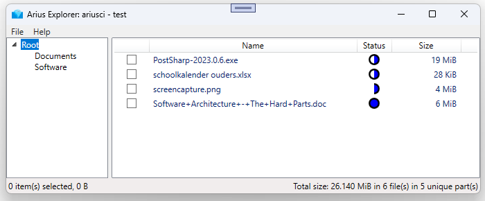

# Arius: a Lightweight Tiered Archival Solution for Azure Blob Storage


[](https://github.com/woutervanranst/Arius/actions/workflows/core-test.yml)
[](https://codecov.io/gh/woutervanranst/Arius)
[](https://github.com/woutervanranst/Arius/actions/workflows/codeql-analysis.yml)

[](https://github.com/woutervanranst/Arius/actions/workflows/release.yml)
[](https://hub.docker.com/r/woutervanranst/arius)
[](https://www.nuget.org/packages/WouterVanRanst.Arius.Core)
[](https://woutervanranst.github.io/Arius/Arius.Explorer.application)

Arius is a lightweight archival solution, specifically built to leverage the Azure Blob Archive tier.

The name derives from the Greek for 'immortal'.

## Why?

1. **Supporting 3-2-1 Backup Strategy**: Arius offers a secure and cost-effective offsite backup solution, complementing offline disk backups. The use of Azure Blob Archive tier results in low-cost archiving, approximately 1 EUR per TB per month.

1. **Single Pane of Glass**: Arius ensures seamless access to offline backups without requiring a separate application. By creating small "pointers" locally, the Windows Explorer's search functionality makes them easily visible.

1. **Encryption**: For those with privacy concerns, Arius uses AES256/openssl-compatible encryption, providing robust client-side encryption.

1. **Deduplication**: Arius assists users who wish to avoid storing duplicate files or file parts. It offers file-level deduplication by default and allows optional chunking and deduplication.


## How

Arius is a command-line tool (CLI) that can be run manually or scheduled. It can also be run as a Docker container.

Arius Explorer is a Windows application that offers a graphical user interface into an Arius repository.

### Arius Explorer



Install it via ClickOnce by clicking on the shield at the top of the page.

The status icon 

| Icon | Local | Azure |
| --- |---|---|
|  | Only the Pointer | Pointer and Binary |
|  | Only the Pointer | Pointer and Binary |
|  | Pointer and Binary | Pointer and Binary |


### Arius CLI

#### Archive

CLI:

<!-- TODO How can they install the CLI? -->

```
arius archive <path>
   --accountname <accountname>
   --accountkey <accountkey>
   --passphrase <passphrase>
   --container <containername>
  [--remove-local]
  [--tier=<hot/cool/archive>]
  [--dedup]
  [--fasthash]
```

CLI in Docker:

```
docker run
  -v <absolute_path_to_archive>:/archive
 [-v <absolute_path_to_logs>:/logs]
  woutervanranst/arius

  archive
   --accountname <accountname>
   --accountkey <accountkey>
   --passphrase <passphrase>
   --container <containername>
  [--remove-local]
  [--tier=<hot/cool/archive>]
  [--dedup]
  [--fasthash]
```

### Restore

CLI:

```
arius restore <path>
   --accountname <accountname>
   --accountkey <accountkey>
   --passphrase <passphrase>
   --container <containername>
  [--synchronize]
  [--download]
  [--keep-pointers]
```

CLI in Docker:

```
docker run
  -v <absolute_path_to_archive>:/archive
 [-v <absolute_path_to_logs>:/logs]
  woutervanranst/arius

  restore
   --accountname <accountname>
   --accountkey <accountkey>
   --passphrase <passphrase>
   --container <containername>
  [--synchronize]
  [--download]
  [--keep-pointers]
```

### Arguments

| Argument | Description | Notes |
| - | - | - |
| path | The path on the local file system | For `archive`:<br>The root directory to archive<br><br>For `restore`:<ul><li>If path is a directory: restore all pointer files in the (sub)directories.<li>If path is a file: restore this file.</ul>
| logpath | Path to the folder to store the logs | OPTIONAL. NOTE: Only for Docker.
| &#x2011;&#x2011;accountname, &#x2011;n | Storage Account Name
| &#x2011;&#x2011;accountkey, &#x2011;k | [Storage Account Key](https://docs.microsoft.com/en-us/azure/storage/common/storage-account-keys-manage?tabs=azure-portal) | Can be set through:<ul><li>Argument<li>Environment variable `ARIUS_ACCOUNT_KEY`<li>Docker environment variable `ARIUS_ACCOUNT_KEY`</ul>
| &#x2011;&#x2011;passphrase, &#x2011;p | Passphrase with which the blobs are encrypted
| &#x2011;&#x2011;container, &#x2011;c | Blob container to use | OPTIONAL. Default: 'arius'.
| &#x2011;&#x2011;remove-local | Remove local file after a successful upload | `archive`-only<br> OPTIONAL. Default: Local files are not deleted after archiving.
| &#x2011;&#x2011;tier | [Blob storage tier (hot/cool/archive)](https://docs.microsoft.com/en-us/azure/storage/blobs/access-tiers-overview) | `archive`-only<br> OPTIONAL. Default: 'archive'.
| &#x2011;&#x2011;dedup | Deduplicate on block level | `archive`-only<br> OPTIONAL. Default: deduplicate on file level.
| &#x2011;&#x2011;fasthash | When a pointer file is present, use that hash instead of re-hashing the full file again | `archive`-only<br> OPTIONAL. Default: false.<br>NOTE: Do **NOT** use this if the contents of the files are modified. Arius will not pick up the changes.
| &#x2011;&#x2011;synchronize | Bring the structure of the local file system (pointer files) in line with the latest state of the remote repository | `restore`-only<br> OPTIONAL. Default: do not synchronize.<br>This command only touches the pointers (ie. `.pointer.arius` files). Other files are left untouched:<ul><li>Pointers that exist in the archive but not locally are created.<li>Pointers that exist locally but not in the archive are deleted</ul>
| &#x2011;&#x2011;download | Download and restore the actual file (contents) |  `restore`-only<br> OPTIONAL. Default: do not download.<br>NOTE: If the file is in the archive blob tier, hydration to an online tier is started. Run the restore command again after ~15 hours to download the file.
| &#x2011;&#x2011;keep-pointers | Keep pointer files after downloading content files | `restore`-only<br>OPTIONAL. Default: keep the pointers. 

### Restoring manually

For detailed instructions on restoring files manually, _without_ using any of the Arius tools, please consult the [Restore Manually](docs/manualrestore.md) section.

## Advanced

### Deduplication

Arius employs deduplication to optimize storage efficiency. For detailed explanations, diagrams, and benchmarks on deduplication, refer to the [Deduplication](docs/deduplication.md) section in the documentation.

## Technical Documentation

### Dependencies


### Arius.Core Domain Model


# Attributions

Arius Icon by [Freepik](https://www.flaticon.com/free-icon/iceberg_2055379?related_id=2055379).

Many thanks to [ReSharper](https://www.jetbrains.com/community/opensource/#support) and [PostSharp](https://www.postsharp.net/metalama/pricing) for their open source generosity.
