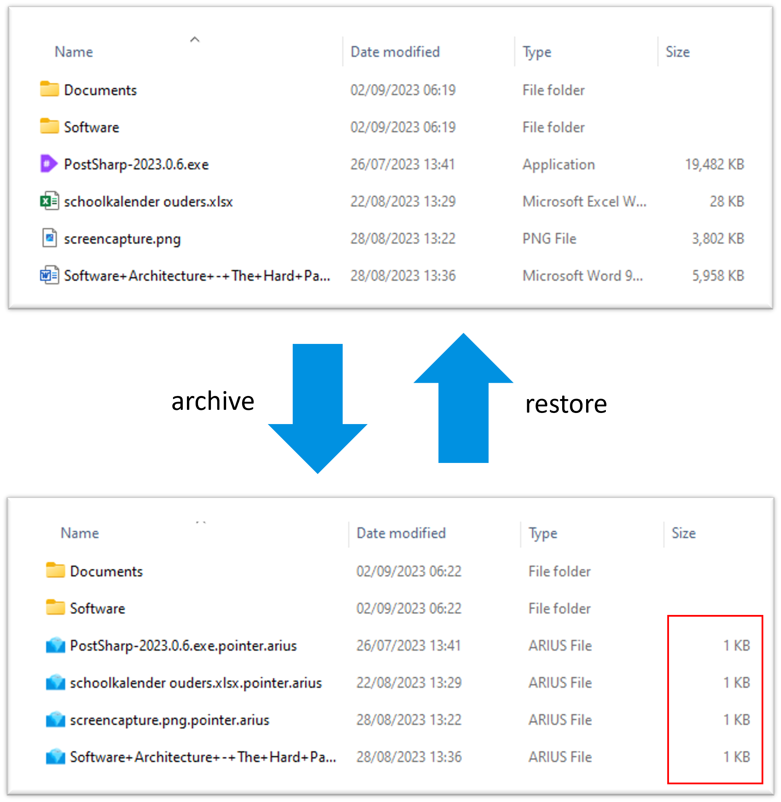

# Arius


[](https://github.com/woutervanranst/Arius/actions/workflows/cli-release-docker.yml)

[](https://github.com/woutervanranst/Arius/actions/workflows/core-release-nuget.yml)

Arius is a lightweight tiered archival solution, specifically built to leverage the Azure Blob Archive tier.

The name derives from the Greek for 'immortal'.

- [Arius](#arius)
  - [Key design scenarios](#key-design-scenarios)
  - [Key design objectives](#key-design-objectives)
  - [Overview](#overview)
  - [Usage](#usage)
    - [Archive to blob storage](#archive-to-blob-storage)
      - [CLI](#cli)
      - [Docker](#docker)
    - [Restore from blob storage](#restore-from-blob-storage)
      - [CLI](#cli-1)
      - [Docker](#docker-1)
    - [Arguments](#arguments)
  - [Installing](#installing)
    - [Docker (Recommended option)](#docker-recommended-option)
    - [Linux (CLI)](#linux-cli)
    - [Windows (CLI)](#windows-cli)
    - [Windows GUI](#windows-gui)
    - [Restore manually](#restore-manually)
      - [Getting the correct binary](#getting-the-correct-binary)
      - [Decrypt and unpack](#decrypt-and-unpack)
  - [Advanced](#advanced)
    - [Deduplication](#deduplication)
      - [How it works](#how-it-works)
      - [In detail](#in-detail)
      - [Deduplication benchmark for large binary files](#deduplication-benchmark-for-large-binary-files)
      - [Deduplication benchmark on general purpose file share](#deduplication-benchmark-on-general-purpose-file-share)
- [Attributions](#attributions)

## Key design scenarios

Why Arius?

**Scenario 1: support 3-2-1 backup strategy**

- I keep my backups on offline disks but want a secure and cheap offsite backup.
- With Arius and the blob archive tier, the cost is approx. 1 EUR per TB per month.

**Scenario 2: single pane of glass of all files**

- I do not want to open a separate application to see what is in my offline backups.
- Arius creates 'pointers' of <1KB each on the local hard drive. That way, the Search in Windows Explorer makes them visible.

**Scenario 3: encryption**

- I want client side encryption (because of \<reasons>).
- Arius uses AES256 / openssl compatible encryption.

**Scenario 4: deduplication**

- I have OCD and do not want to store duplicate files/parts of files twice.
- Arius deduplicates on file level by default, and can optionally 'chunk' files into multiple parts and deduplicate on these.

## Key design objectives

- [x] Maintain the local file structure (files/folders) by creating 'sparse' placeholders (Scenario 2).
- [x] Files, folders & filenames are encrypted clientside (Scenario 3).
- [x] The local filestructure is _not_ reflected in the archive structure (ie it is obfuscated) (Scenario 3).
- [x] Changes in the local file _structure_ do not cause a reshuffle in the archive (which doesn't sit well with Archive storage).
- [x] Never delete files on remote.
- [x] No central store to avoid a single point of failure.
- [x] File level deduplication (Scenario 4).
- [x] Variable block size deduplication (Scenario 4).
- [x] Leverage common tools, to allow restores even when this project would become deprecated.
- [ ] Point in time restore (FUTURE).

## Overview

Arius is a tool that archives a local folder structure to/from Azure Blob Storage Archive Tier. The following diagram shows the concept of how Arius works.



## Usage

### Archive to blob storage

#### CLI

```
arius archive <path>
   --accountname <accountname>
   --accountkey <accountkey>
   --passphrase <passphrase>
   --container <containername>
  [--remove-local]
  [--tier=<hot/cool/archive>]
  [--dedup]
  [--fasthash]
```

#### Docker

```
docker run
  -v <absolute_path_to_archive>:/archive
 [-v <absolute_path_to_logs>:/logs]
  ghcr.io/woutervanranst/arius:latest

  archive
   --accountname <accountname>
   --accountkey <accountkey>
   --passphrase <passphrase>
   --container <containername>
  [--remove-local]
  [--tier=<hot/cool/archive>]
  [--dedup]
  [--fasthash]
```

### Restore from blob storage

#### CLI

```
arius restore <path>
   --accountname <accountname>
   --accountkey <accountkey>
   --passphrase <passphrase>
   --container <containername>
  [--synchronize]
  [--download]
  [--keep-pointers]
  
```

#### Docker

```
docker run
  -v <absolute_path_to_archive>:/archive
 [-v <absolute_path_to_logs>:/logs]
  ghcr.io/woutervanranst/arius:latest

  restore
   --accountname <accountname>
   --accountkey <accountkey>
   --passphrase <passphrase>
   --container <containername>
  [--synchronize]
  [--download]
  [--keep-pointers]
```

### Arguments

| Argument | Description | Notes |
| - | - | - |
| path | The path on the local file system | For `archive`:<br>The root directory to archive<br><br>For `restore`:<ul><li>If path is a directory: restore all pointer files in the (sub)directories.<li>If path is a file: restore this file.</ul>
| logpath | Path to the folder to store the logs | OPTIONAL. NOTE: Only for Docker.
| &#x2011;&#x2011;accountname, &#x2011;n | Storage Account Name
| &#x2011;&#x2011;accountkey, &#x2011;k | [Storage Account Key](https://docs.microsoft.com/en-us/azure/storage/common/storage-account-keys-manage?tabs=azure-portal) | Can be set through:<ul><li>Argument<li>Environment variable `ARIUS_ACCOUNT_KEY`<li>Docker environment variable `ARIUS_ACCOUNT_KEY`</ul>
| &#x2011;&#x2011;passphrase, &#x2011;p | Passphrase with which the blobs are encrypted
| &#x2011;&#x2011;container, &#x2011;c | Blob container to use | OPTIONAL. Default: 'arius'.
| &#x2011;&#x2011;remove-local | Remove local file after a successful upload | `archive`-only<br> OPTIONAL. Default: Local files are not deleted after archiving.
| &#x2011;&#x2011;tier | [Blob storage tier (hot/cool/archive)](https://docs.microsoft.com/en-us/azure/storage/blobs/access-tiers-overview) | `archive`-only<br> OPTIONAL. Default: 'archive'.
| &#x2011;&#x2011;dedup | Deduplicate on block level | `archive`-only<br> OPTIONAL. Default: deduplicate on file level.
| &#x2011;&#x2011;fasthash | When a pointer file is present, use that hash instead of re-hashing the full file again | `archive`-only<br> OPTIONAL. Default: false.<br>NOTE: Do **NOT** use this if the contents of the files are modified. Arius will not pick up the changes.
| &#x2011;&#x2011;synchronize | Bring the structure of the local file system (pointer files) in line with the latest state of the remote repository | `restore`-only<br> OPTIONAL. Default: do not synchronize.<br>This command only touches the pointers (ie. `.pointer.arius` files). Other files are left untouched:<ul><li>Pointers that exist in the archive but not locally are created.<li>Pointers that exist locally but not in the archive are deleted</ul>
| &#x2011;&#x2011;download | Download and restore the actual file (contents) |  `restore`-only<br> OPTIONAL. Default: do not download.<br>NOTE: If the file is in the archive blob tier, hydration to an online tier is started. Run the restore command again after ~15 hours to download the file.
| &#x2011;&#x2011;keep-pointers | Keep pointer files after downloading content files | `restore`-only<br>OPTIONAL. Default: keep the pointers. 


## Installing

### Docker (Recommended option)

```
docker pull ghcr.io/woutervanranst/arius
```

### Linux (CLI)

Execute the `install.sh` file in the install folder.

```
dotnet arius.dll <see syntax above>
```

### Windows (CLI)

TODO

<!-- Install the latest windows Dapr CLI to `c:\dapr` and add this directory to User PATH environment variable. Use `-DaprRoot [path]` to change the default installation directory

```powershell
powershell -Command "iwr -useb https://raw.githubusercontent.com/dapr/cli/master/install/install.ps1 | iex"
https://chocolatey.org/install.ps1

```
-->

### Windows GUI

TODO

### Restore manually

#### Getting the correct binary

1. Open the `.arius.pointer` file (with Notepad) and look for the `BinaryHash` value.
1. Using Azure Storage Explorer, navigate to the correct container in the storage account and, in the `chunks` folder, locate the blob with the maching name.
`. Decrypt and unpack using the below steps

If the pointer is not available locally:
1. Download the most recent file in the `states` folder in the storage account`
1. Decrypt and unpack using the below steps
1. Using `DB Browser for SQLite`, navigate to the `PointerFileEntries` table, filter on `RelativeName` to find the correct `BinaryHash`
`. Proceed as above

If you cannot locate a chunk with matching `BinaryHash` value or arius was run with the `--dedup` option:

1. In the `chunklist` folder, download the blob with matching value
1. Open the file with Notepad
1. Download, decrypt and unpack each of the chunks as listed in the file
1. Concatenate the chunks (using `cat chunk1 chunk2 chunk3 ... > original.file` (Linux) or `copy chunk1 + chunk2 + chunk3 + ... > original.file` (Windows)) 

#### Decrypt and unpack

Arius files are gzip'ped and then encrypted with AES256. To decrypt:

```
# 1. Decrypt with OpenSSL
openssl enc -d -aes-256-cbc -in $ENCRYPTED_FILE -out original.file.gz -pass pass:$PASSPHRASE -pbkdf2

# 2. Unpack
gzip -d original.file.gz -f

# 3. at this point 'original.file' will be the original binary
```

## Advanced
### Deduplication

#### How it works

1. Scan the file system for files meeting the optimization policy.


2. Break files into variable-size chunks.


3. Identify unique chunks.


4. Place chunks in the chunk store and optionally compress.


#### In detail


1. The filesystem is indexed. Arius finds `report v1.doc` and calculates the SHA256 hash to be `binaryhash1`. This binaryhash does not yet exist in blob storage, so this binary needs to be uploaded.
2. Arius breaks ("chunks") the file into variable sized chunks: `chunkhash1`, `chunkhash2` and `chunkhash3`. These chunkhashes do not yet exist in blob storage, so these chunks need to be uploaded.
3. `chunkhash1`, `chunkhash2` and `chunkhash3` are compressed (using gzip) and encrypted (using AES256) and then uploaded to the `chunks` container in blob storage. This is the bulk of the storage size and the use of the archive tier is highly advised, as the chunks are not needed until restore.
4. A `manifest` is created describing the chunks that make up the binary.
5. A `metadata entry` is created describing the original length, archived length and the number of chunks. While not strictly required (easier to consult size etc)
6. A pointer is created on the local file system (`report v1.doc.pointer.arius`), containing just the 64 hex characters of the SHA256 hash of the original binary (`binaryhash1`). Optionally, the original binary can be deleted since it is not succesfully archived.
7. A `pointerfile entry` is created linking the `binaryhash` with the path on the local filesystem and the point-in-time version. This is used when restoring the full archive onto an empty local disk.<br><br>
8. The filesystem is further indexed. Arius finds `report v1 (copy).doc` and calculates the SHA256 hash to be `binaryhash1`. This binaryhash *already* exists in blob storage so this binary does *not* need to be uploaded.
9. A pointer is created on the local file system (`report v1 (copy).doc.pointer.arius`), containing just the 64 hex characters of the SHA256 hash of the original binary (`binaryhash1`). Optionally, the original binary can be deleted since it is not succesfully archived.
10.  A `pointerfile entry` is created linking the `binaryhash` with the path on the local filesystem and the point-in-time version. This is used when restoring the full archive onto an empty local disk.<br><br>
11. The filesystem is further indexed. Arius finds `report v2.doc` and calculates the SHA256 hash to be `binaryhash2`. This binaryhash does not yet exist in blob storage, so this binary needs to be uploaded.
12. Arius breaks ("chunks") the file into variable sized chunks: `chunkhash1`, `chunkhash2` and `chunkhash4`. Only the last chunk does not exist in blob storage, so only that one needs to be uploaded.
13. `chunkhash4` is compressed, encrypted and uploaded to the `chunks` container in blob storage.
14. A `manifest` is created describing the chunks that make up the binary.
15. A pointer is created on the local file system (`report v2.doc.pointer.arius`), containing just the 64 hex characters of the SHA256 hash of the original binary (`binaryhash2`). Optionally, the original binary can be deleted since it is not succesfully archived.
16. 


A 1 GB file chunked into chunks of 64 KB, with each chunk having a SHA256 hash (32 bytes = 64 hex characters) * 4 bytes/UTF8 character = 4 MB of manifest

((1 GB) / (64 KB)) * (64 * 4 bytes) = 4 megabytes

#### Deduplication benchmark for large binary files 

12 mp4 files of on average 192 MB, totalling 2,24 GB. Benchmark performed on an Azure D8s_v3 VM in the same region as the storage account.

| Min. Chunk Size (B) | Original KB | Total Chunks | Deduped KB | Archive KB | Time  | MBps  | Avg Chunk Size (KB) | Compression | Compression + Dedup |
|-|-|-|-|-|-|-|-|-|-|
| N/A  | 2.410.419.052  |      12  |      0  | 2.333.672 |  0:45 | 51,08 |   N/A | 99,14% | 99,14% |
| 1024 | 2.410.419.052  | 262.666  | 125,19  | 2.346.100 | 36:00 | 1,06  |  8,93 | 99,67% | 99,67% |
| 4096 | 2.410.419.052  | 174.589  | 112,33  | 2.341.994 | 24:00 | 1,60  | 13,41 | 99,50% | 99,49% |
| 8192 | 2.410.419.052  | 165.619  | 111,63  | 2.341.567 | 23:00 | 1,67  | 14,14 | 99,48% | 99,48% |


Conclusions:
- While the chunking algorithm finds duplicate chunks in mp4 files, it is not more effective in achieving a better end result than plain gzip compression (99,48% vs 99,14%)
- A minimum chunk size of 4096 KB achieves the best characteristics while keeping the flexibility of chunking:
  - A significant reduction in number of chunks and runtime (-33%) 
  - A significant increase in speed (+50%)
  - A comparable number of usable deduped chunks (only 11% less)
- A minimum chunk size of 8192 KB achieves further improvements across these dimensions but only marginally so, while significantly reducing the potential on bigger datasets
- These conclusions have been confirmed on a larger dataset (20,7 GB of mp4 files).

#### Deduplication benchmark on general purpose file share

31.757 files totalling 71,7 GB of general purpose files (historical backups).

| Min. Chunk Size (B) | Original GB | Total Chunks | Deduped GB | Archive GB | Time  | MBps  | Avg Chunk Size (KB) | Compression | Compression + Dedup |
|-|-|-|-|-|-|-|-|-|-|
| 4096  | 71,704  | 2469531 |      3,219  | 65,943 | - | - |   29,37 | 96,45% | 91,97% |

Conclusions:
- General purpose files are much better suited for deduplication and offer a significant increase in space reduction compared to gzip


# Attributions

Arius Icon by [Freepik](https://www.flaticon.com/free-icon/iceberg_2055379?related_id=2055379).