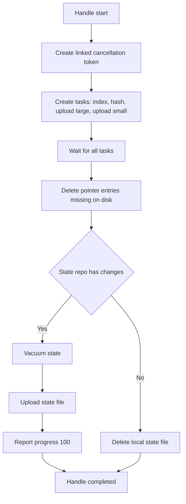
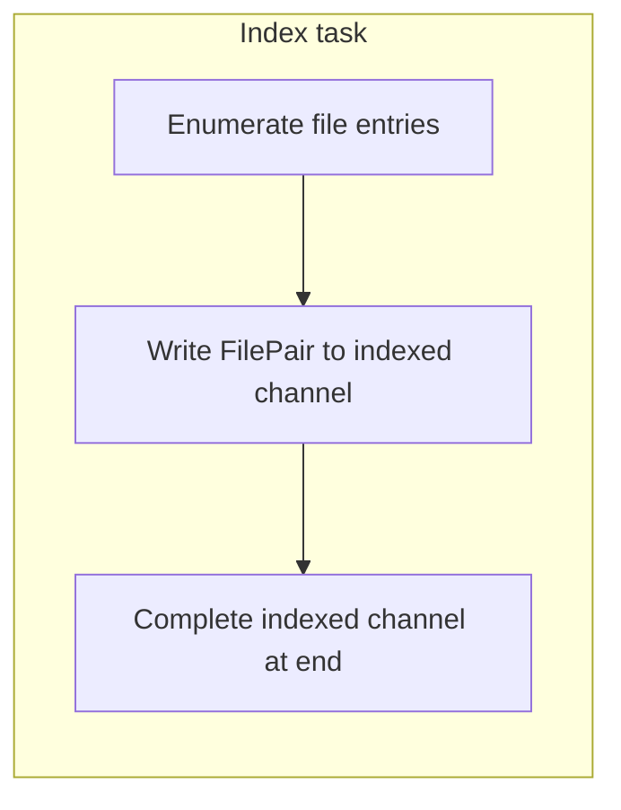
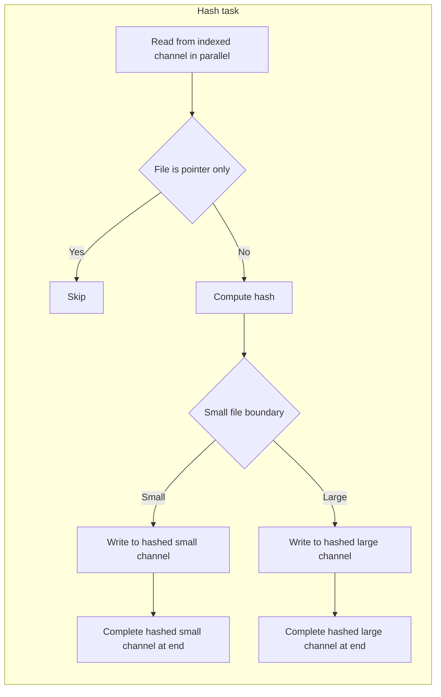
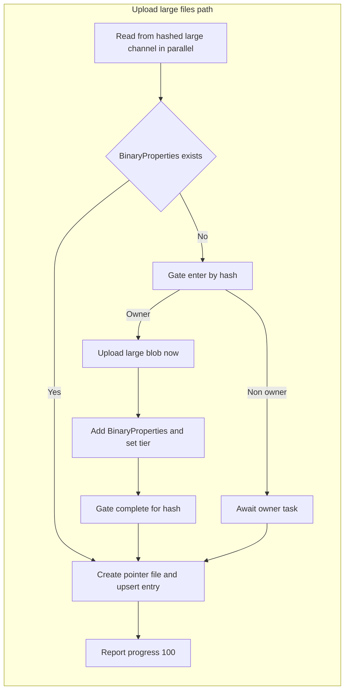
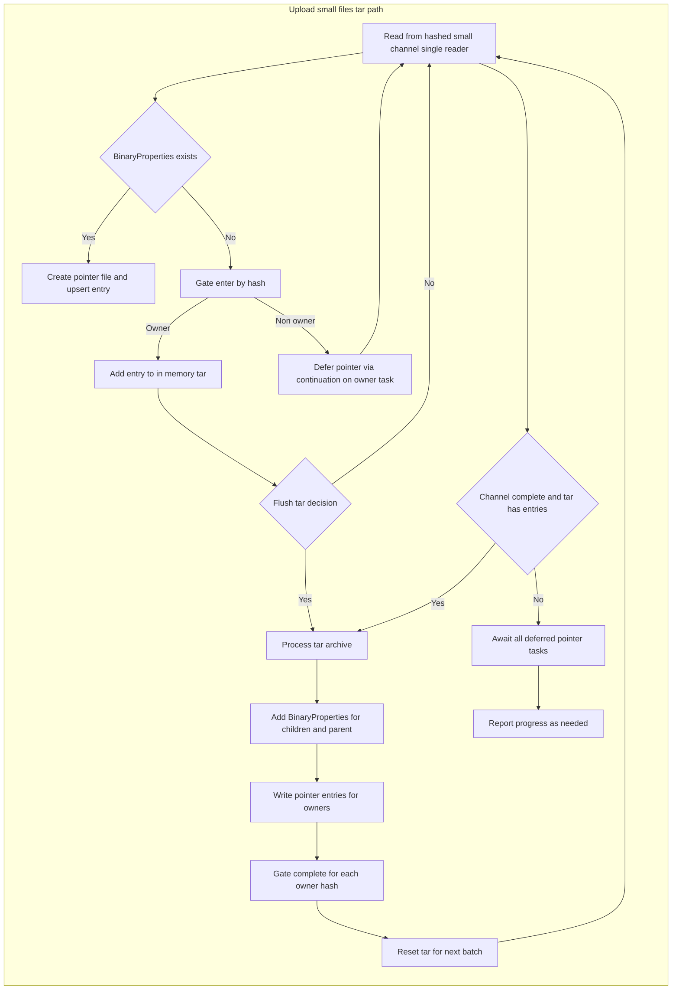
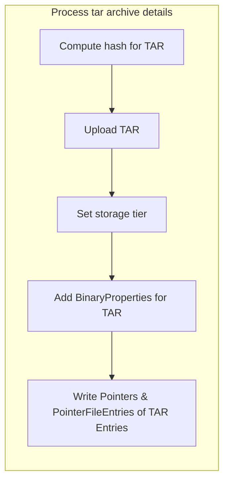

# Archive Command Documentation

## Overview

The **Archive Command** is responsible for orchestrating the archival of files into Azure Blob Storage with client-side compression, encryption, and deduplication.

It implements a **multi-stage pipeline** with parallel processing, TAR batching for small files, and intelligent storage tier management.
The process ensures that identical file content is uploaded only once, storage operations are minimized, and data is secure before leaving the local system.

### Key Features

* **Deduplication**: SHA256 hashes ensure identical files are stored only once.
* **Optimized Storage**: TAR batching reduces blob transactions for small files.
* **Tiering**: Storage tier policies applied automatically after upload.
* **Client-Side Security**: Compression occurs before AES256 encryption, ensuring efficiency and privacy.
* **Resilient Orchestration**: Linked cancellation, error handling, and per-hash gates prevent deadlocks and duplicate uploads.

## Orchestration Flow

The archive command coordinates four concurrent tasks:

1. **Indexing** files from the file system.
2. **Hashing** files and routing them to either large or small pipelines.
3. **Uploading large files** individually.
4. **Batching small files** into compressed TAR archives.

Mermaid overview of the orchestrator:

After processing, the state repository is updated, cleaned, and uploaded if changes occurred. Otherwise, the local state is discarded.

## Pipeline Design

The archival process is built around **channels** that pass work between stages.

### Channels

* **`indexedFilesChannel`** → Produced by the indexer, consumed by hashers.
* **`hashedLargeFilesChannel`** → Produced by hashers, consumed by large file uploaders.
* **`hashedSmallFilesChannel`** → Produced by hashers, consumed by the small file TAR pipeline.

This design allows high throughput with controlled parallelism.

## Index Task

The **indexer** enumerates files from the file system and pushes `FilePair` objects into the `indexedFilesChannel`.

## Hash Task

The **hasher** processes `FilePair`s in parallel:

* Skips pointer-only files.
* Computes hashes for binary files.
* Routes small files to the small-file TAR path and large files to the large-file path.

## Large File Uploads

Files above the **small file boundary** are uploaded individually:

* Only the **first uploader per unique hash** performs the upload (`InFlightGate` ensures single ownership).
* Deduplication ensures duplicates only wait for completion.

**Transformation**:
`Original File → GZip → AES256 → Blob Storage`

## Small File Uploads (TAR Archives)

Small files are aggregated into **TAR archives** to reduce blob operations:

* Owners enqueue their file into the TAR.
* Non-owners (duplicates) defer pointer creation until the owner completes.
* When TAR size reaches threshold (or at end of input), the archive is flushed and uploaded as a **single blob**.

**Transformation**:
`Multiple Files → TAR → GZip → AES256 → Blob Storage`

### TAR Processing Details

When a TAR flush occurs:

* Parent TAR stream is hashed and uploaded.
* `BinaryProperties` are recorded for both child files and parent TAR.
* Pointers are written for all files.
* Deferred duplicates are flushed afterward.

