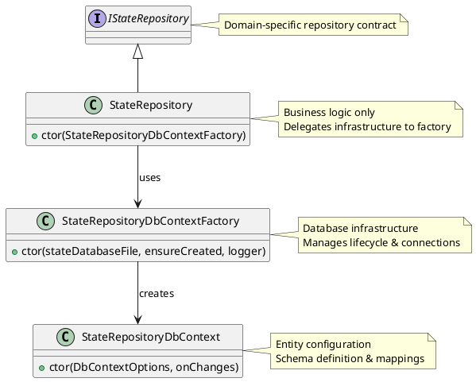

# StateRepository Types

## IStateRepository
High-level repository interface that provides domain-specific operations for managing file archival state. Abstracts database operations behind a clean API for tracking binary properties and pointer file entries.

## StateRepository
Concrete implementation of `IStateRepository` that focuses purely on business logic and repository operations. Delegates all database infrastructure concerns to the factory while providing domain-specific data access patterns.

## StateRepositoryDbContext
Entity Framework Core DbContext that defines the database schema, entity configurations, and value converters. Handles change tracking through callback mechanism and manages SQLite-specific entity mappings.

## StateRepositoryDbContextFactory
Database infrastructure factory that centralizes all EF Core/SQLite concerns. Manages DbContext creation, database lifecycle operations (vacuum, delete), and connection pool management. Tracks changes across all database operations.

## Key Design Principles

### Separation of Concerns
- **StateRepository**: Business logic and domain operations only
- **StateRepositoryDbContextFactory**: Database infrastructure and lifecycle management
- **StateRepositoryDbContext**: Entity configuration and schema definition

### Change Tracking
The factory maintains change tracking across all database operations through the `OnChanges` callback mechanism. This allows the application to know when modifications have been made during command execution.

### Database Operations
- **Business Operations**: Handled by StateRepository (GetBinaryProperty, UpsertPointerFileEntries, etc.)
- **Infrastructure Operations**: Handled by Factory (Vacuum, Delete, DbContext creation)
- **Schema Definition**: Handled by DbContext (entity mapping, value converters)

## Architecture Diagram

