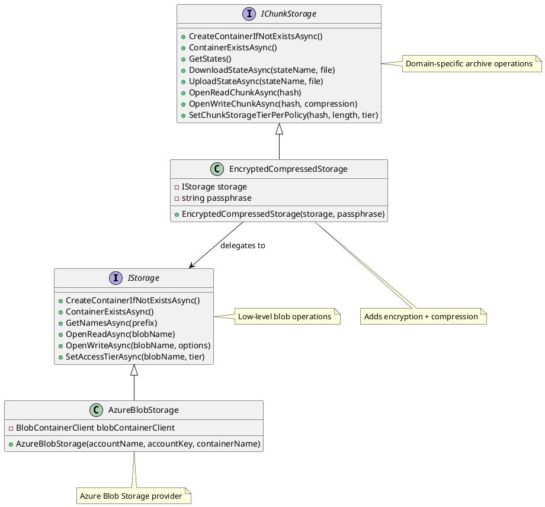

# Storage Architecture

## Overview

Arius uses a layered storage architecture to provide secure, efficient archival storage with encryption, compression, and tiered storage capabilities.

## Storage Interfaces

### IStorage
Low-level blob storage abstraction for basic container and stream operations. Provides fundamental storage primitives without domain-specific logic.

### IChunkStorage  
Archive-specific storage interface that handles both chunked file data and application state. Operates at the domain level with concepts like hashes, compression levels, and storage tiers.

## Implementations

### AzureBlobStorage
Concrete implementation of `IStorage` that provides Azure Blob Storage integration. Handles authentication, container management, and blob operations.

### EncryptedCompressedStorage
Decorator implementation of `IChunkStorage` that adds client-side AES256 encryption and compression before delegating to the underlying `IStorage`.

## Architecture Diagram

## Design Principles

- **Separation of Concerns**: `IStorage` handles infrastructure, `IChunkStorage` handles domain logic
- **Decorator Pattern**: `EncryptedCompressedStorage` enhances storage with encryption/compression
- **Provider Pattern**: `AzureBlobStorage` can be swapped with other cloud providers
- **Security**: Client-side encryption ensures data privacy in cloud storage