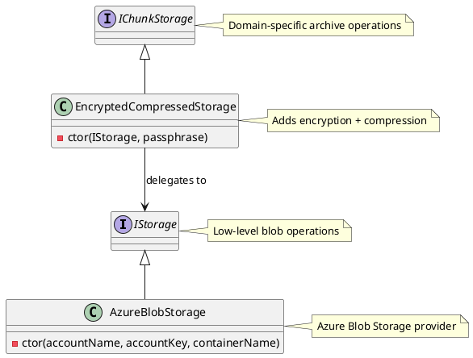

# Storage Types

## IStorage
Low-level blob storage abstraction for basic container and stream operations. Provides fundamental storage primitives without domain-specific logic.

## AzureBlobStorage
Concrete implementation of `IStorage` that provides Azure Blob Storage integration. Handles authentication, container management, and blob operations.

## IChunkStorage  
Archive-specific storage interface that handles both chunked file data and application state. Operates at the domain level with concepts like hashes, compression levels, and storage tiers.

## EncryptedCompressedStorage
Concrete implementation of `IChunkStorage` that adds client-side AES256 encryption and compression before delegating to the underlying `IStorage`.

## Architecture Diagram

